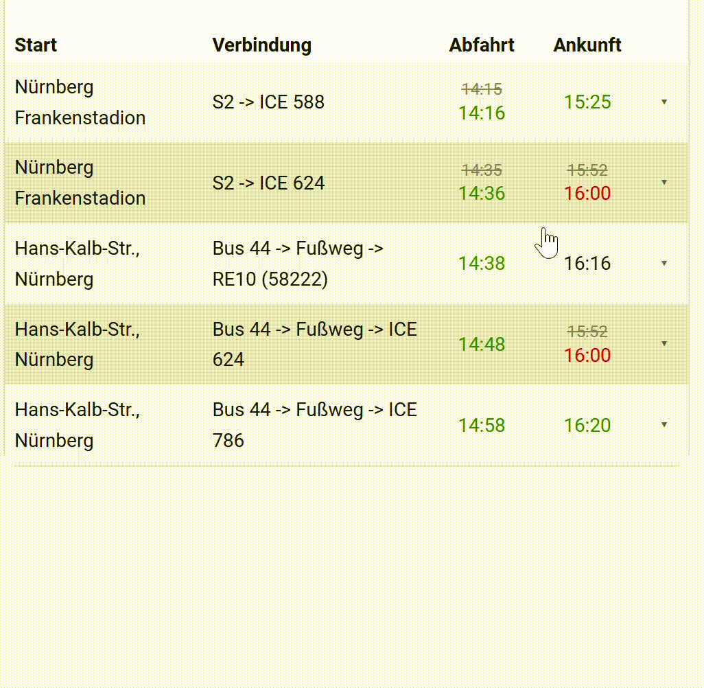

# 🚉 DB Info Card

A custom Lovelace card for [Home Assistant](https://www.home-assistant.io/) that displays Deutsche Bahn connections with real-time data in a clean, interactive table — with expandable rows showing detailed segment information.

> **Requires the [DB Info Integration](https://github.com/EiS94/db_info)**



---

## ✨ Features

- Displays all connections of a DB Info entry in a sortable table
- Real-time delay visualization
- Click any row to expand detailed segment information (departure/arrival stops, platforms, per-segment delays)
- Visual card editor (no YAML required)

---

## 📋 Requirements

- [Home Assistant](https://www.home-assistant.io/) 2023.x or newer
- [DB Info Integration](https://github.com/EiS94/db_info) installed and configured

---

## 📥 Installation

### Via HACS

Unfortunately not yet available in HACS

### Manual Installation

1. Download `db-info-card.js` from the [latest release](https://github.com/EiS94/db-info-card/releases/latest)
2. Copy it to `config/www/db-info-card.js`
3. In Home Assistant go to **Settings → Dashboards → Resources**
4. Add a new resource:
   - **URL:** `/local/db-info-card.js`
   - **Type:** JavaScript module
5. Reload your browser

---

## ⚙️ Configuration

### Visual Editor

The card ships with a built-in visual editor. When adding the card in the Lovelace UI, click **"DB Info Card"** and use the editor to configure it — no YAML needed.

The connection dropdown automatically detects all DB Info sensors and groups them by route (e.g. `sensor.home_hbf_verbindung_1` through `_5` appear as a single entry `"Home → Hbf"`).

### YAML Configuration

```yaml
type: custom:db-info-card
entity_prefix: sensor.home_hbf_verbindung_
title: Zuhause → Würzburg Hbf      # optional
show_start: true                   # optional, default: true
delay_threshold: 5                 # optional, default: 5
```

### Options

| Option | Type | Default | Description |
|---|---|---|---|
| `entity_prefix` | `string` | **required** | Prefix of the DB Info sensors, e.g. `sensor.home_hbf_verbindung_` |
| `title` | `string` | _(none)_ | Card title shown in the header |
| `show_start` | `boolean` | `true` | Show or hide the "Start" column |
| `delay_threshold` | `number` | `5` | Minutes of delay from which the time is shown in red |

---

## 🔍 Expanded Row Details

Clicking a row expands it to show:

- **Summary:** Total duration, number of transfers, delay badge, and any problem notices
- **Segments:** Each leg of the journey with departure/arrival stop, planned and real-time, and platform number

---

## ☕ Support

If you find this card useful, consider supporting the developer:
<a href="https://www.buymeacoffee.com/eis94" target="_blank"></a>